<h1 align="center"> 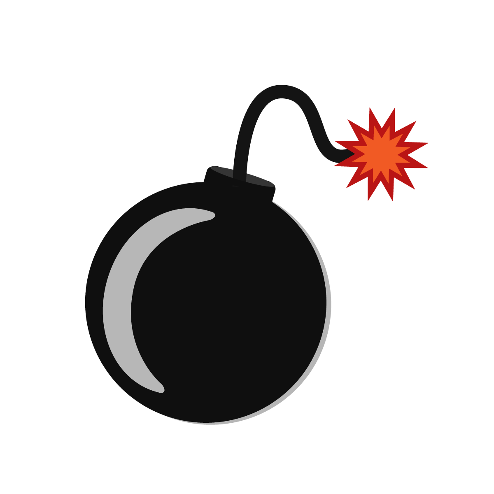Tap Tap Defense </h1> <br>

<p align="center">
    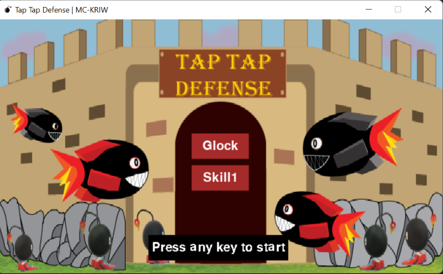
</p>
<p>
<p align="center"> Tap Tap Defense <br>
(Tugas Besar PBO RA-04) <br>
</p>
<p align="center">
    <a href="https://github.com/rajastra/Tap-Tap-Defense/graphs/contributors">
    
  </a>
    <a href="https://www.pygame.org/news">
    
  </a>
</p>

<br>

## Table of Content

- [Description of Project](#description-of-project)
- [How to Run a Game](#how-to-run-a-game)
- [How to Run a Game in Docker](#how-to-run-a-game-in-docker-linux)
- [How to Play a Game](#how-to-play-a-game)
- [UML Class Diagram](#uml-class-diagram)
- [Contributors of Project](#contributors-of-project)

## Description of Project

Proyek yang kami buat yaitu Proyek game sederhana bernama <b>Tap Tap Defense</b>, <b>Tap Tap Defense</b> yaitu sebuah game dua dimensi yang konsep bermainnya hampir sama dengan game mobile <b> Smash Ant </b> yaitu pertahankan batas penjagaan kita dengan cara menghabisi musuh yang datang dari arah berlawanan batas penjagaan dengan cara mengarahkan cursor ke musuh dan menekan tombol kiri mouse dan Player akan kalah apabila darah player habis(Musuh yang berhasil melewati perbatasan sebanyak darah player) dan bila player berhasil menahan musuh secara terus-menerus maka musuh juga akan bertambah kuat. Selain itu, didalam game ini juga terdapat skill yang dapat digunakan tetapi menggunakan mana,skill diaktifkan dengan mengklik mouse sebelah kanan.

<br>

## How to Run a Game

- #### Install Dependecies

```bash
git clone https://github.com/rajastra/Tap-Tap-Defense
cd Tap-Tap-Defense

pip install pygame
```

- ### Run a Game

```python
py ./main.py

atau

python main.py

atau

python3 main.py
```

<br>

## How to Run a Game in Docker (Linux)

<br>

### Step 1

Buka Terminal pada Linux anda masing-masing dan pastikan docker sudah terinstall di komputer anda.
<br>

### Step 2

Pull Images from Docker Hub
<br>
Syntax :

```bash
docker pull mckriw/pygame-taptapdefense:latest
```

Or

```bash
sudo docker pull mckriw/pygame-taptapdefense:latest
```

<br>

### Step 3

Jalankan Perintah berikut ini:

```bash
XAUTH=$HOME/.Xauthority
touch $XAUTH

xhost +
xhost + username (username linux anda)
```

<br>

### Last Step

Run a Game

```bash
docker run -it -v /tmp/.X11-unix:/tmp/.X11-unix  -e DISPLAY=unix$DISPLAY --device /dev/snd mckriw/pygame-taptapdefense
```

Or

```bash
sudo docker run -it -v /tmp/.X11-unix:/tmp/.X11-unix  -e DISPLAY=unix$DISPLAY --device /dev/snd mckriw/pygame-taptapdefense
```

<br>

### Link Video YouTube

Untuk penjelasan dari perintah-perintah menjalankan game pygame di docker container dapat dilihat pada video dibawah ini.
<br>
Klik Gambar untuk menonton :)
<br>

[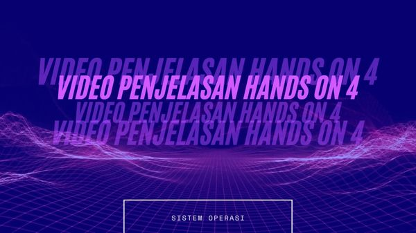](https://www.youtube.com/watch?v=zPNXTTTtTmg)

## How to Play a Game

- ### Start a Game

Berikut ini adalah gambar untuk panduan memulai Game <b> Tap Tap Defense</b>

  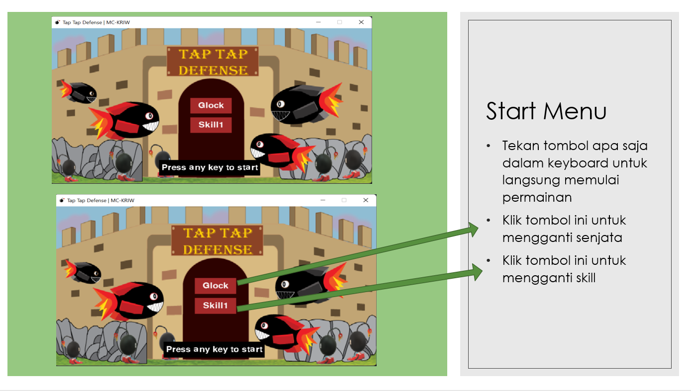

- ### Game Play

Berikut ini adalah gambar untuk panduan bermain <b> Tap Tap Defense</b>

  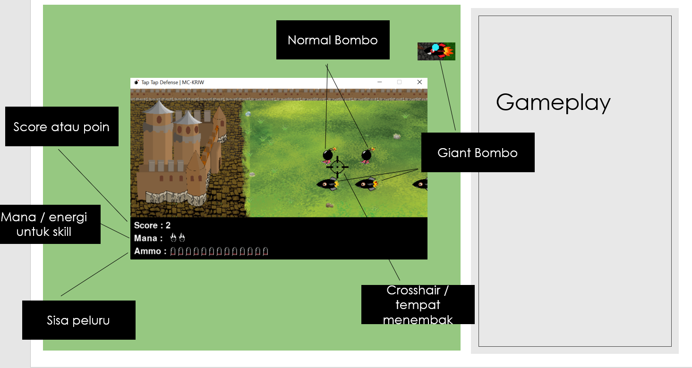

Gameplay :

1. Tembak bombo agar tidak mencapai batas dan mendapatkan poin sebanyak banyaknya
2. Jika bombo melewati batas maka kastel akan hancur sedikit demi sedikit
3. Permainan berakhir jika kastel hancur lebur

- ### End Game

Permainan akan berakhir apabila kastel sudah hancur lebur
<br>
Bisa dilihat di video dibawah ini:
<br>

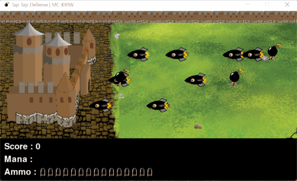

- ### Control in Game

Berikut adalah gambar untuk panduan Control in Game seperti cara shoot klik apa, reload klik apa,dan sebagainya.
<br>
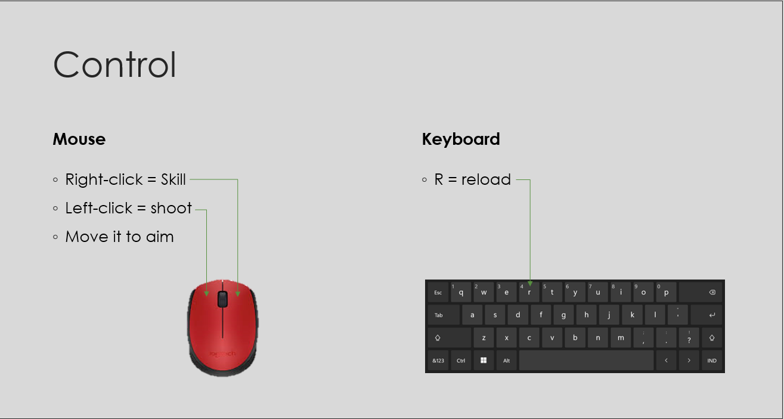

<details>

<summary>What if... Player choose Glock Weapon?</summary>
Jika player memilih Senjata Glock di dalam Game ,makaplayer akan mendapat amunisi sebanyak 15, namun untuk hitkepada giant bombo menjadi kurang damagenya dibandingkandengan revolver.
<br>

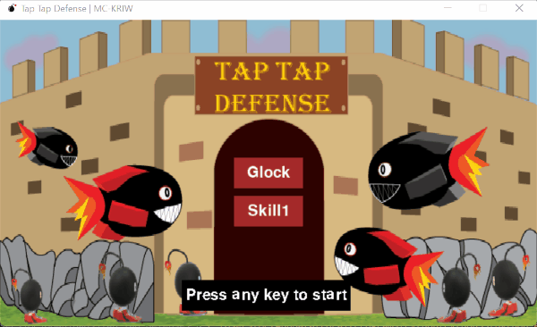

</details>
<br>
<details>
<summary>What if... Player choose Revolver Weapon?</summary>
Jika player memilih Senjata Revolver di dalam Game ,maka player hanya akan mendapat amunisi sebanyak 6 (lebih sedikit dibandingkan Glock), namun untuk hit kepada giant bombo lebih besar dibandingkan dengan Glock.
<br>


</details>
<br>
<details>
<summary>What if... Player choose Skill 1?</summary>
Jika player ingin menggunakan skill1,maka player harus menggunakan mana sesuai ketentuan berikut dan fungsi dari skillnya.
<br>
Skill 1 (3 mana) = Mendorong Normal Bombo sejauh 100 pixel dan menghentikan pergerakan Giant Bombo untuk sementara
<br>

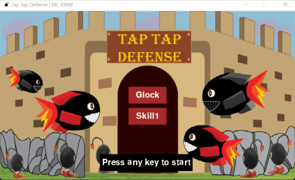

</details>
<br>
<details>
<summary>What if... Player choose Skill 2?</summary>
Jika player ingin menggunakan skill2,maka player harus menggunakan mana sesuai ketentuan berikut dan fungsi dari skillnya.
<br>
Skill 2 (5 mana) = Memberikan 5 damage serta menghentikan sementara pergerakan semua bombo yang ada
<br>

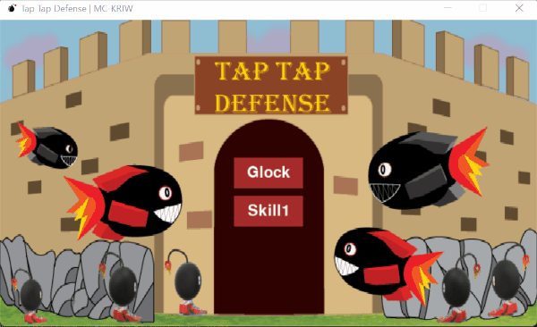

</details>
<br>
<details>
<summary>What if... Player choose Skill 3?</summary>
Jika player ingin menggunakan skill2,maka player harus menggunakan mana sesuai ketentuan berikut dan fungsi dari skillnya.
<br>
Skill 3 (10 mana) = Menghapus semua bombo yang ada
<br>


</details>
<br>
<details>
<summary>What if... Player wanna cheat?</summary>
1. Cheat Button
<br>
Berikut ini cara untuk mengaktifkan cheatnya:
<br>

<br>
2. Cheat Murder (Keyboard P atau p)
<br>
Cheat ini merupakan cheat yang meningkatkan FPS dari 30 menjadi 240 sehingga gameplay menjadi sangat cepat dan musuh akan berjalan sangat cepat dan bermunculan sangat banyak sehingga cheat ini dinamakan bunuh diri.
<br>


<br> 3. Cheat Mana (Keyboard O atau o)
<br>
Cheat ini berfungsi untuk mengisi mana menjadi full sehingga player bisa menggunakan skill sesuka hati.
<br>


</details>

<br>

## UML Class Diagram

Berikut adalah UML Class Diagram Proyek Kelompok kami:

<br>
Klik link dibawah ini untuk melihat UML Class Diagram lebih jelas:
<br>
<a href="https://viewer.diagrams.net/?tags=%7B%7D&highlight=0000ff&edit=_blank&layers=1&nav=1&title=tugas.drawio#R7V1rc6O4tv01rsm9VTnF2%2FbHJD1Jz5yeqe5J33l8ShGbOHQw%2BADuJP3rr8AIg9A2YCPJx96npk7HGMuYtSSkvdbeGpk3y7e72F09%2FxbNvWBkaPO3kflhZBiG4zjkn%2BzI%2B%2BaIbtuTzZFF7M%2BLY9sD9%2F4PrzioFUfX%2FtxLaiemURSk%2Fqp%2BcBaFoTdLa8fcOI5e66c9RUH9W1fuwmscuJ%2B5QfPoX%2F48fS6O6s50%2B8ZHz188F189McabN5YuPbn4JcmzO49eK4fMn0fmTRxF6eav5duNF2R3j96Xv355%2Fyv49OLc%2Ffol%2BY%2F7f9f%2F%2Fvr7n5ebxm77fKT8CbEXpns3%2FePl6fbjn9a3v1efb7%2B8andXj79eFh%2FRvrvBurhf9174zU3d4ien7%2FQ%2BJq%2F%2BMnBD8ur6KQrT%2B%2BIdcheu3cBfhOTvGbk8LyYHvntx6hMIroo30mhFjs6e%2FWD%2ByX2P1tmPSFJ39kJfXT9Hsf%2BDNOsG5C2dHCBvx2nBJsOpnXGffZIc1sjR2EvIOZ%2FpndHLQ5%2FcJC3OmUVB4K4S%2FzG%2F4OyUpRsv%2FPA6StNoSRuK1uHcmxevSqjzF2kcvZTkyT7fEY8Ct%2BxueG8VNhb43HnR0kvjd3IKfVcr8HhnXr9WmOsUx54rpLUMq%2BgxRW9ZlG2XX%2FcH6V1uuCA34fDvM5z617kBAT50U%2B86u41JlYfkj8pP3R7K2dmDqXqDqSODAKGF7jL7RSPzKmuB4MESl9z7tELSwHtKQYomK3fmh4tP%2BTkfrO2RP4rfnh2KyGefgpwez%2F587oU5fVLSaTYMyzizisil5DfHvib%2FkVt4o%2F3LHtnkgm7Ia337mvyXnR6nN1FImOb6OaU8Qt9XL6Mwh2w7e3I72d7rGPbFukqtGsh9ETUARJfu4qQB3THUPKfLoPhTFOy2IQ%2F2r86Xu%2Fj%2BZfrhy5P2xUnevn74cXVpA7C7y2WEuF8DeHalAoj7eKIYdwfAfb7E7i4Odl2zFOM%2BBnCPvSBy5w%2Bpf%2BLPb8X4m3tO6QbDfwLgXwNeQ9iHhd2WOLvjwj4FYPeT5DlbMlPkv8bkfQR%2FUPAnqud4ejOuQNHfDPsl%2FLdukCD%2Bw%2BJvaKrneia0Ws%2FDOg9JdntKCqze79fxkztDGgxMA1P11M%2BEhoFi7oc8kMIDR%2BIUkHt9JjQaZDMBZIGUuI8xUR3vszgsYCAO%2FFxgKG7HRgdgg%2B8t%2BC8JkllzFPCvGR8%2BXOoNUphNUpgcAgTuoxd8jhI%2F9aOs%2FXhzLkMMVUFcU%2B841ZuIGuLBvp096S%2F%2B5%2BR6sahR2jRUL9RNKCCfD9MIZXcoLdVDLRRj38y7ThZKAePrWPVS2oSwXK%2FmbppF0C6SWeyRG2zcZML8qWIroJtOJS6TudfXlETugmj20kAQ8F5oI%2FRejIbyXlyyZgjHFmy%2BMOvfZ06O13wBaTg188VPdz%2Bd6NjTOtA4ndmmwHzBf6xAcmzVfaHbJweo6FCMsxN25eYLE%2BrJNfcF4j4w7srNFyakwlbdF1S1QdgHgl29%2BcKEZFie%2B8LCbj8w%2FsrNFxakwJTAk0Povhgad%2BXuCwsSYNF%2BIR595fYLC4rkov1CAv7q7RfWTlEGBVc5NFBuv7B4iivaL2TzQKb9gs8DSEJA%2F4VEGij3X%2FCWggzE5%2B6%2F6B3Hlem%2F4KdFQgu8%2FFFP%2Fj1BsbeugYlCVrkfw4ZC9OjH6Df0SvVj8KHcnQSFWHbHUqYhgz%2FiQqGVMzNkCBhylRsy6NN81xzJC%2BdXWV0S8uoxd2uY1%2BRQYZfQtc3LWz%2BgE8oWP0N9VurNFx59tHnBY%2FT68%2FbAdX6AvEGZwoVilxuCzPTjmdcOGZk6LLxd0BaYZFe7E1gekGTIc1P%2Fe%2FWDO60Tn6M8K5TaJgzGpmFoZr2JzY8sPrXlQ%2F%2BGNneh0RAB332vnFZ0LPCC9frX2GNt52VdGsz59u7zy%2FtKzzdbzp%2FUz7darkef7jyf%2FLG5IYP6TXTe1Oc0%2ByF3vkAdRUfdERki2ZS4fTuiyfQQY8xcy0Ad0Rj364mN8wfuiWz7rT2R7blOS%2Fvs%2BRMZPbc5072Olo%2BZt%2BTeXflemDQ6MrobxbsbbaaPcSs9UT5Wp1r2hOnV3cyNtK%2BU32dxvu9IzI065I2puRsJVmTW3SDvmczly259kMORRzBha27DguIn54PrPuvvDdS9LIyicOVfH2RpckN%2F6eZRYqwqIqhT83yMUsGnc8wG%2BK9u8FLi7m5mhoj9kNhzzYxywYcib8%2BrEvpzryAlAniei1Hqo9xp9vrLDOLVHHEX96Tnuhjl4g51%2BCVBAqEXCD3Pwih3rDcA6L23VRDNvV%2BWWd1vSgFyd%2F38gP3hrKkgYh3HczPKHQVaqIAGJjmDAtfQKJcJkK%2BVMmG%2BjusrwAmSYGAS8NyMckkAuVr9pKDBCN3tIhnAMzLKZQDkZ%2FWTJF2HCL9I%2BLmOR7nwQ3FdrCgsFHhT%2BUQQctG9laiPEffBcXeUT%2Fsgge69xD12w3m0vFhGjw%2Brwit%2Ber471USYSpz68YMCvPk%2FA%2FK5pzD0X%2BFbescJnagcBgOa0S%2Fdb%2BuT9UaLQNJQLtFAU%2FPUfSHLczcL0l2s3ODdi8kNmy8XiG53dHkFyaQ%2BiHWtJQBzsp1VwOPUGqteR5eKLid5bB1eZMspxLO7MUZTvTDWNbjua6aYXQQ%2BuQXGjY%2Bo9rA7qV716hoU7%2BAkHK0Cd%2FNoRaj7Q20rnz31S3uIVvm97pfYUOZEZO8pTjcq7m1rlgOdK7WmORSEyKiUf6Bc4WxeHpjxYDKGen1q1JvomvFgWy0NARkPzWQhpiGTaSd6ekq8WhNDmaaNZiyOor7lam6Yr4wCLWPOY2Gb3yyYr93ZyyIn700URDF5P4y2SQJFmo%2FRfcJNO1ex0XhxWaNye%2B8%2BpYIPoxMVUqRh1YyfdceKBiv%2BW8EapuvTCsjSoWuanT%2F6oN2pEvRi4WzGmkYd0mvKSNhukHuluBzICM6Dn0%2BS7k%2BH6TAUofoIbVYTQJKd2YIVkvzhfY%2BC79lMkGEKJluxyVYtM0l4ggMPOUzK7JlWkudzFVqi1kvJ%2F3GqpeRb2Lajf%2FfKtJJbX6xLLXlndGOMrlCdHRh85RXlrU4V5R3EfVjclVeUt7pUlDexvw%2BMu%2FqS8lZzSQKXlNdtZMDQDFBeVJ5iigY8ucArrypvY1V5hfArLytP55pYVl4JAdTXlbexrvwx8EB5YXkb8o1gYXmpRFBeWd7GyvLHwAOZpeX5F8gLAjEgn7gxWwCuMovL868PivGcV3F5EdCqry4PYnvO1eX3wlJ9efndIbnT7Kji8JRZYp5%2FgRCeZ1ZiXgS4MmvMA37e5siLJXLVuzbGTD34Ca9k7YTDlD1dG0daIhfgLDQi1WwbI8P5zzrKKHV3vf0bBye27%2FeycvAoJ25wAveTwuqqh6%2Fj2%2BDnmTkkww8pPLX6qrVya9pFXm719OYgqtnAs3hIZoMBsKFScBUtHoMDz%2FV4SEa%2BqfSwFVebKQSI%2B4G485wdknEHSzFUK64i9INDz%2FN2yIUeFPWSVcXZgaXVhcDP83ZIhh%2BS8siyNX5%2F8OF6uzgBFLUa5Bk%2B5LLCgGaAG1agwCuJCTzLh2QmYO0tMRGfjnM%2BURqvfp7Vt8RgqX68xvpbAvGdqh%2BFoVS7My%2FAtReeXBOGZDyh7Llzr8C1H6A8J4ZkQCFbDZbg2h9WniFDMqw9HBlYg%2BsQrHn%2BDLlY0yhsBevfo3jpZp8sjBoMnGjPEG%2FPsLrYM3jV2syT2sEYoCwk2wL2jN%2FRnrGj6%2FeyZ8itBUkLvKE9Q0QUrgV%2BmVsfAxcIJeChPUM6G2TuhQxcIBS5q9gzdBwGhgZe6kbIwBU2w3ysPcNA3IfGXfk%2ByLoJVtqq2jMQ%2BsGhV74Vsm6hPUMd%2FDK3Qwbg5wk7DMwov%2FZf0XXd3ViY%2FLqjeCLKr%2F2w7LqPlcBeCsk5KL8OgK%2BlfhSG1B2UX%2FeJpilfQYO1DFF%2B3QdQnj9CLqBgaUKUX%2FeGlWuTkAwrpG%2Bg%2FDow1jwHhWSsjfaVTmUTpMcgyhTPbGMjuquENqruc9RBs2S2SOq5KZL35qd%2FZ58l6G1e%2FUNbIn9%2FeKu%2BeB9V16rMfkb77azUT2bnqZcHbnwxZrZFmtA4Wd9tkRy93pDDKrfAtkhXm6BHeVrR08ALdphdk8bFBUPXxVYGcKZOv%2FPHu8%2B3G%2FtF9Gvfbrke9r7ak5b2WRy02vnkj80dH1bD5haXxH7fs9%2FTvlfdU23XtoJSRgjHsv41rfyvvv%2FOhN0pp%2FM2amO2n4kZL2ynX%2F9vnN%2FS%2Fy27X%2F9n22%2Fr%2F9a4X%2F9v3Fc5%2Fb8ZCPtcTOWYUQDtVhKq4TAcuDS67j5takwvPEG%2FlQ3atmdRfMol8DvRbVf%2FPmJvFVgRcRO3PWFUhetrLdirN1aBFRSXbugi8sKQV2%2Bioo%2BUBvKzOErIDfHjEeY3i6bBEViqHHBvk8p%2BVuislMIG9UYrh%2Be2YWBGu0V%2FZLv6qITZLRwoQXrhpQ8vfhCghNsHT0f9uA35Z6qWC8S0B6ZT9aMvtLxGm8UeC2v1tigHWlmvE%2B8hyUfdWZRgGfM%2BqKo3Q42hlRNWqR8gGqZ8YTzmLYgYACt6XLTK73Y%2Fxa0U67L39tffxt0FOAJL%2FF5R7bKX%2F9ALyF5sP5a%2FEiDc%2FXh5uv34p%2FXt79Xn2y%2Bv2t3V46%2BX5HZvTmzX7SDmFAzMflc1jm4VV3CohMdoTnSS0Fezm1q72wEku0Y7l0w7NDGWthM9PSXeQarfRONeKSiaM4IJ7a3Q%2BRPGNWHotfMFiWy0kkalU%2F9vo1fnslVlxGwZnx8L8Wqz%2Brx2Zy%2BLvJvfREEUk%2FfDaCvVFUq9UfaoWRSGmRj0SL%2BcPlT2GVTHuzWty2G6wuW4jWrDwdX0RDRr70Jw0cX%2Ffy1eA8FVHw%2FZBkSi1wwiffRTaBZUiSOxiDbDN6MOUncZXNqNcy%2B5mU8KDvgQTw4mReP5Nh2oU0%2FqzWqyaGJwkkZwTO4JHzWP0dkA6xwUCV9zcYvwHQafLrP3NZVfhO8w%2BCSix8n3wAlST%2FRMuulDafeTiF8zyID49cTP0uszIlvaDNfg5GogfAd2P0Pi3IXjuf8lTNLM8fTvLDCHS5UjXKrozOPWnkzlEaa5pL0hTZE75rjLLEy%2F%2BX9yBFe6x0ofq04fYyyRPk33RUYfpMnx0cTQ6zSRN8jo42ZA5P4lfxxxSlthMoj4ZBBdd6Y1MnT2iJS54yecDDKG3A214rs%2F6T9BA9056t%2BbPr5D%2F%2B7GL4HyN5QR4CfuLB9XKbK3bpCgJXxoBqjPCZk0Y0vVWsuYECQOfPVpIRMoHSCIZvU621hyUQQDjiAjhBZ9bGYGRcm24qaN0A8NvfL0DzK%2FBaCfV5KBEPnBkVdeZncbL25Yz5%2BeyDqlBB%2B3vR8efeVVdsvf0szrx41upXCgcz1egRyAHvu4BbYCPvA2PpY8DcSNj8VEeDrO8oSlgk6givqb%2BM4FW0gyKwVxej1cJMKqx3J9AmX7blKUivwkBLUHqMpr%2FJYZLdU8pErqELktz9EiCt2gmj9Uf5Btz%2FkU5eNsNsx%2B89L0vZB23HUa1Qd0frU%2F%2Bk5LslGZXfTPtgU5yUZAvyjWt9VsI35aElBG9FDDYEs2EZAFNJhkM2mu76nC2CQXKowKFMZLo%2FP%2BnmcgMU6hqERdYtRQYmx08iOWGKdQtKEWYDZPDlPhi8oW5NVLi1MoxvASRrOXx2yU327giJHGoQmgXl6cQhu5MmFmHUWGocFXryyW1roG%2Bm8l8OgqEID8EQiLUMwJXUVyKKBeYdShmFRdX0CNSRgHlOuM%2BhQaBlBnlMMB9TqjPsUdXYUg21UxFKYrTaGKlKgrDYOw8tJ3Bm8f9htjdKWhunRgTE71sGxYzXibDHVpT6WoVKVGlQJ4pUKlaA8qOr9qVZcMQBQ4NMNRY2qxWR13pBssz9FoLvCpvtSkF%2BpLCvQlu6v9pJGOf3ryEukgwIylLi8ZKC81%2BvjxykuEgwCqGGsaZI3ZxgDlMlPZMmawSQdfucRELgEAHzPYpDDgCHQmA8pMrxkMdOz9g2OvXmkyMZVFMQfUS020KDqmshwDH5TLToaJqSxClnpdxSRRkkOpeaDkIAhh5XsoGSamsgwNqnodiV6BolSW0fGIBsVNHlwLcJhtViw2nNt1wxl7Wi%2Bzd2l30xR6bzszrV%2BwU5TzBfeRmfJ%2FoNB9ZAy7GVm6y2PFDJtR25CgbYwZCnAWn3R3oXrmzHTHhOREpA0bioLF6zAkT7ZyEfQ1Xp%2FeGviAh2frBnXdOCbu2WlDwa2EULYa3sTw1tDgc5QN2eBDBZrojpMY3hLMAY7AIZkD9BHT4MDt5%2FsR1mkShjxP2JAMPZg%2BNQuiSu4c9n5hHOg6xxTY%2FSGBI1toIAXEU4Cjb8geBqCw52NZ2%2F8Bs2ok0YEjb8imAxQiJYt7gqE3f9jyAhkhnBE8WUQ2IyAD1MJdehkcD6iGSyIDJy1H9oTB4JCBgRnVzz0iQR2ngsLUTwdaDfhJFsX1E3LjLpbRI%2Bkus3X8tvmHfO9N8hxFKUpmfbBWPqQ70JzP%2B05%2BW3JRRP8Q1R6ocmr6yUYVmrrlis7DJqp3gaB2B7Usi6YQ1F2zr8ySgoD2AdRSvt52IDHNIwtt7KP9IR0rXzM7TRXtPhtyyaHfvHDdABMFfQmCvk0V9R3JiuXW5%2BeWrOhA0l%2BR1LRdzZ%2Be9HPAUOQAlXx36PlchgkbiajzDoO5EqI1LWzgCfyS2QCpO5xYLtJCEi14mr9kWvBieBktcmiRAaIZwNX%2BJVMAiva9eu4qCh8SL6hWUEUuCOMCzwMglwtTyANY48JDjISQQgieI0AyIUBfYFZ%2BB8cGaVTguQGkUsHUoBlklQo4NMjhA9cLIHnewBOOGJhR%2Fu2PLE%2FY5yErTP4dQ9rRPHZfMS%2ByP6KcvEjZY3dzjv9zbtPBmLSqmPQEY9I7%2BAqW9a%2FsF366s4v9x6Kipx9vWNrUYFMpzhwHmDm2MUB5KNrUIBsDxhylMEB51NnUIN9DBq2BFBBOAfVhZ1ODQo0ZtiZyQDwHlIebTQ2KLmbYYihJEg%2BUR5lNatHiPw%2BQCJKIoD7GrEMx5vyhgESQQwT1wWVTNzhEYGDG4HJ%2FZFUHl01wq04MLu%2BHqMDgMnkZR1Faje3F7ur5t2juZWf8Pw%3D%3D" target="_blank">UML Class Diagram (!!! Gambar Lebih Jelas disini !!!) atau bisa klik gambarnya langsung</a>
<br>
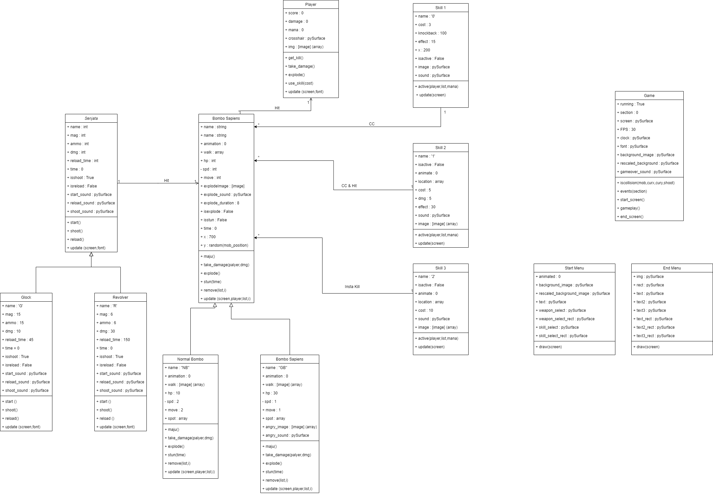
<br>

## Contributors of Project

<br>

Thanks to Contribue this Project 🙏

<br>

<table>
<tr>
    <td align="center"><a href="https://github.com/120140056"><br /><sub><b>Christian <br>
    (120140056)</br></sub></a><br /></td>
    <td align="center"><a href="https://github.com/irwantoYS"><br /><sub><b>Irwanto Yezekiel <br>Sihotang <br>(120140227)</b></sub></a><br /></td>
    <td align="center"><a href="https://github.com/wellaamandaa"><br /><sub><b>Wella <br>Amanda <br>(120140057)</b></sub></a><br /></td>
    <td align="center"><a href="https://github.com/rajastra"><br /><sub><b>Raja  Saputera <br>(120140228)</br></sub></a><br /></td>

</tr>
<tr>
    <td align="center"><a href="https://github.com/120140219"><br /><sub><b>M. Rafi Irfan Lubis <br>(120140219)</b></sub></a><br /></td>
    <td align="center"><a href="https://github.com/krisnasaputtra"><br /><sub><b>Krisna Saputra <br>(120140221)</b></sub></a><br /></td>
</tr>
</table>
```
